# CONTEXT.md — Systeme de gestion de l'occupation du site VCN (CROUS-T)

Ce fichier est la source de verite du projet. Donnez-le a votre agent
(Antigravity, etc.) avant de generer du code pour une app, pour eviter les
incoherences de nommage entre les personnes.

## Stack
- Backend : Django + Django REST Framework, JWT (simplejwt), MySQL en prod / MySQL en dev
- Frontend : React (equipe separee)
- Doc API : drf-spectacular, disponible sur `/api/docs/`

## Apps et responsables

| App | Modeles | Responsable |
|---|---|---|
| `core` | BaseModel, permissions | commun |
| `comptes` | Utilisateur, Demandeur, Notification, JournalAudit | Moi |
| `demandes` | Demande, Dossier, HistoriqueStatutDemande, AppelCandidature, CritereAppel, MembreCommission, VoteCommission | Personne 1 |
| `patrimoine` | Local | Moi |
| `contrats` | Contrat | Moi |
| `paiements` | Echeance, Paiement | Moi |
| `terrain` | Plainte, InspectionQHse, Sanction | Moi |
| `fidelite` | AvisCantine | Moi |

## ATTENTION — a harmoniser en equipe

Le `RoleUtilisateur` du diagramme de classes ne liste pas tous les acteurs
presents dans le diagramme de cas d'utilisation (ex: OCCUPANT, TECHNICIEN,
MEMBRE_COMMISSION, ADMINISTRATEUR_SI, AGENT_QHSE manquaient). Ils ont ete
ajoutes dans `comptes/models.py` par prudence — confirmez ensemble que la
liste est complete avant de batir les permissions dessus.

## Diagramme de classes (source : DiagClasse_V6_FINAL_mermaid.mmd)

```mermaid
classDiagram
  direction TB

  %% ==========================================
  %% 1. ENUMERATIONS
  %% ==========================================
  class RoleUtilisateur {
    <<enumeration>>
    USAGER
    BUREAU_COURRIER
    AGENT_DCUVE
    DIRECTEUR_DCUVE
    DIRECTEUR_CROUS_T
    SERVICE_JURIDIQUE
    SERVICE_COMPTABLE
    SERVICE_TECHNIQUE
    AGENT_TERRAIN
    AGENT_QHSE
    CELLULE_COMMUNICATION
    AMICALE
    ADMINISTRATEUR_SI
  }
  %% ADMINISTRATEUR_SI = superadmin technique (comptes, rôles, paramètres système, journal d'audit)
  %% DIRECTEUR_CROUS_T = admin métier (décisions, pilotage) — jamais confondus, cf. grill

  class TypeDemande {
    <<enumeration>>
    RENOVATION
    CONSTRUCTION_CANDIDAT
    CONSTRUCTION_CROUST
    VENTE_PRODUIT
    PRESTATION_SERVICE
    LOCAL_ARTISANAL
  }

  class StatutDemande {
    <<enumeration>>
    EN_ATTENTE
    MITIGEE_COMPLEMENT
    FAVORABLE
    DEFAVORABLE
  }

  class AvisSanitaireExterne {
    <<enumeration>>
    NON_CONCERNE
    EN_ATTENTE
    FAVORABLE
    DEFAVORABLE
  }

  class Gestionnaire {
    <<enumeration>>
    CROUS_T
    AMICALE
  }

  class EtatLocal {
    <<enumeration>>
    BON_ETAT
    NECESSITE_RENOVATION
    DEGRADE
    EN_TRAVAUX
  }

  class TypeLocal {
    <<enumeration>>
    RESTAURATION
    MULTISERVICES
    PAPETERIE
    ARTISANAT
    AUTRE
  }

  class TypeSignalement {
    <<enumeration>>
    TECHNIQUE
    NON_CONFORMITE_QHSE
    ENVIRONNEMENT
    DENONCIATION_ILLEGALE
  }

  class NiveauUrgence {
    <<enumeration>>
    FAIBLE
    MOYENNE
    ELEVEE
  }

  class StatutPlainte {
    <<enumeration>>
    OUVERTE
    EN_COURS_TRAITEMENT
    RESOLUE
    REJETEE
  }

  class NiveauSanction {
    <<enumeration>>
    AVERTISSEMENT
    RAPPEL_A_L_ORDRE
    CONVOCATION
    EXPULSION
  }

  class StatutSanction {
    <<enumeration>>
    NOTIFIEE
    LEVEE
  }

  class CanalNotification {
    <<enumeration>>
    SMS
    EMAIL
    PUSH_APP
  }

  class StatutEcheance {
    <<enumeration>>
    NON_ECHUE
    EXIGIBLE
    PAYEE
    EN_RETARD
  }

  class ModePaiement {
    <<enumeration>>
    MOBILE_MONEY
    ESPECES
  }

  class TypeControleQHSE {
    <<enumeration>>
    SANITAIRE
    TECHNIQUE
    ELECTRIQUE
  }

  class StatutVerificationEtudiant {
    <<enumeration>>
    NON_SOUMIS
    EN_ATTENTE
    VALIDE
    REJETE
  }

  class StatutAvis {
    <<enumeration>>
    PUBLIE
    SIGNALE
    MASQUE
  }

  class TypeCritere {
    <<enumeration>>
    GENRE
    TRANCHE_AGE
    EXPERIENCE_PREALABLE
    AUTRE
  }

  class AvisCommission {
    <<enumeration>>
    FAVORABLE
    DEFAVORABLE
    ABSTENTION
  }

  %% ==========================================
  %% 2. IDENTITE
  %% ==========================================
  class Utilisateur {
    +String idUtilisateur
    +String nomComplet
    +String email
    +String motDePasse
    +RoleUtilisateur role
    +Date dateCreation
    +Boolean delegationActive
    +Date delegationExpiration
    +sAuthentifier()
    +reinitialiserMotDePasse()
    +activerDelegation()
    +revoquerDelegation()
  }

  class Demandeur {
    +String idDemandeur
    +String contact
    +Boolean estEtudiant
    +String matriculeEtudiant
    +String carteEtudiantFichier
    +StatutVerificationEtudiant statutVerificationEtudiant
    +Date carteEtudiantDateValidation
    +Float scoreFidelite
    +mettreAJourScore()
    +consulterStatutDemande()
    +soumettreCarteEtudiant()
  }

  class Notification {
    +String idNotification
    +String contenu
    +Date dateEnvoi
    +CanalNotification canal
    +Boolean estLue
    +genererAlerteAutomatique()
  }

  %% ==========================================
  %% 3. CYCLE DE LA DEMANDE ET DOSSIER
  %% ==========================================
  class Demande {
    +String idDemande
    +Date dateDepot
    +TypeDemande type
    +StatutDemande statut
    +AvisSanitaireExterne avisSanitaireExterne
    +Date dateAvisSanitaire
    +String referenceAvisSanitaire
    +Boolean estArchive
    +verifierRecevabilite()
    +valider()
    +rejeter()
    +demanderComplement()
    +enregistrerAvisSanitaireExterne()
    +archiver()
  }

  class Dossier {
    +String idDossier
    +Boolean piecesRecepissees
    +Boolean estComplet
    +enregistrerDossier()
    +verifierCompletudeGlobale()
  }

  class HistoriqueStatutDemande {
    +String idHistorique
    +Date horodatage
    +StatutDemande ancienStatut
    +StatutDemande nouveauStatut
    +String commentaireActeur
  }

  class AppelCandidature {
    +String idAppel
    +Date dateLancement
    +Date dateCloture
    +String description
    +Boolean estActif
    +publierAppelCandidature()
    +cloturerAppel()
  }

  class CritereAppel {
    +String idCritereAppel
    +TypeCritere typeCritere
    +String valeurCible
    +Integer poids
    +Boolean actif
  }

  %% ==========================================
  %% 4. COMMISSION (VOTE CONSULTATIF)
  %% ==========================================
  class MembreCommission {
    +String idMembreCommission
    +Date dateDesignation
    +Boolean actif
  }

  class VoteCommission {
    +String idVote
    +Date dateVote
    +AvisCommission avis
    +String commentaire
  }

  %% ==========================================
  %% 5. PATRIMOINE ET FINANCES
  %% ==========================================
  class Local {
    +String idLocal
    +String reference
    +String localisation
    +TypeLocal typeLocal
    +String zoneCartographie
    +Float surfaceM2
    +EtatLocal etatPhysique
    +Gestionnaire gestionnaire
    +Boolean estLibre
    +changerEtat()
  }

  class Contrat {
    +String idContrat
    +Date dateSignature
    +Date dateDebut
    +Integer dureeMois
    +Integer preavisMois
    +Float redevanceMensuelle
    +Float montantCaution
    +Boolean estGratuit
    +Boolean estActif
    +Date dateResiliation
    +String motifResiliation
    +redigerContrat()
    +appliquerGratuiteEtudiante()
    +prononcerExpulsion()
  }

  class Echeance {
    +String idEcheance
    +Date dateExigibilite
    +Float montantDu
    +Float montantPenalite
    +StatutEcheance statut
    +genererEcheancier()
    +appliquerPenaliteRetard()
  }

  class Paiement {
    +String idPaiement
    +Date datePaiement
    +Float montantRegle
    +ModePaiement mode
    +String referenceTransaction
    +String referenceQuitus
    +validerPaiement()
    +editerQuitus()
  }

  %% ==========================================
  %% 6. EXPLOITATION ET TERRAIN
  %% ==========================================
  class Plainte {
    +String idPlainte
    +TypeSignalement type
    +StatutPlainte statut
    +NiveauUrgence urgence
    +Date dateDepot
    +Date dateResolution
    +String description
    +String localisationLibre
    +String photoPreuve
    +Boolean estAnonyme
    +Float latitude
    +Float longitude
    +intervenirSurPlainte()
    +cloturerPlainte()
  }

  class InspectionQHse {
    +String idInspection
    +TypeControleQHSE typeControle
    +Date dateVisite
    +Boolean estConforme
    +String observations
    +Float latitude
    +Float longitude
    +emettreFicheSanitaire()
  }

  class Sanction {
    +String idSanction
    +NiveauSanction niveau
    +StatutSanction statutSanction
    +Date dateApplication
    +Date dateLevee
    +String motif
    +notifierInfraction()
    +leverSanction()
  }

  class AvisCantine {
    +String idAvis
    +Integer noteEtoiles
    +String commentaire
    +Date datePublication
    +Date dateDerniereModification
    +StatutAvis statut
    +modererAvis()
  }

  %% ==========================================
  %% 6bis. PILOTAGE ET ADMINISTRATION (UC80-84)
  %% ==========================================
  class JournalAudit {
    +String idEntree
    +String action
    +String cible
    +Date horodatage
    +String details
  }

  %% ==========================================
  %% 7. RELATIONS
  %% ==========================================
  Utilisateur "1" *-- "0..1" Demandeur : possede_profil
  Utilisateur "1" <-- "*" Notification : recoit
  Utilisateur "1" <-- "*" HistoriqueStatutDemande : est_auteur_de
  Utilisateur "1" --> "*" InspectionQHse : realise
  Utilisateur "1" --> "*" MembreCommission : devient
  Utilisateur "1" --> "*" AppelCandidature : publie
  Utilisateur "1" --> "*" Contrat : signe_pour_crous_t
  Utilisateur "0..1" --> "*" Demandeur : valide_carte_etudiant_de

  Demandeur "1" --> "*" Demande : soumet
  Demande "1" *-- "1" Dossier : possede
  Demande "1" *-- "1..*" HistoriqueStatutDemande : trace
  AppelCandidature "1" <-- "*" Demande : repond_a
  AppelCandidature "*" --> "1" Local : concerne
  AppelCandidature "1" *-- "0..*" CritereAppel : definit
  Demande "0..*" --> "0..1" Local : candidature_directe_sur

  Demande "1" --> "0..1" Contrat : aboutit_a
  Demande "0..*" --> "0..1" Contrat : concerne_renovation_de
  Demandeur "1" --> "*" Contrat : signe_en_tant_que_titulaire
  Contrat "1" --> "1" Local : encadre
  Contrat "1" *-- "*" Echeance : planifie
  Echeance "1" <-- "0..*" Paiement : regle_par

  MembreCommission "1" --> "*" VoteCommission : emet
  Demande "1" <-- "*" VoteCommission : recoit_avis_de

  Local "1" <-- "*" InspectionQHse : subit
  Local "0..1" <-- "0..*" Plainte : vise
  Utilisateur "1" --> "*" Plainte : depose_signalement
  Utilisateur "1" --> "*" Plainte : traite

  Local "1" <-- "0..*" Sanction : est_visee_par
  Contrat "0..1" --> "0..*" Sanction : peut_entrainer
  InspectionQHse "1" ..> "0..*" Sanction : declenche
  Plainte "1" ..> "0..*" Sanction : declenche
  Utilisateur "1" --> "*" Sanction : prononce
  Utilisateur "1" --> "*" JournalAudit : declenche

  Local "1" <-- "*" AvisCantine : evalue
  Demandeur "1" --> "*" AvisCantine : redige
```

## Priorites (2 personnes)

- Personne 1 (`demandes`) porte le coeur du workflow (cycle de la demande).
- Moi (tout le reste) : `comptes`, `patrimoine`, `contrats`, `paiements`, `terrain`, `fidelite`. Je livre en priorite `Local` et `Notification` car `demandes` en depend.

## Conventions

- Tous les modeles metier heritent de `core.models.BaseModel` (id UUID,
  `date_creation`, `date_modification`).
- Champs et modeles en francais, snake_case (`date_depot`, pas `depositDate`).
- Chaque app expose ses routes dans son propre `urls.py`, monte sous
  `/api/<app>/` dans `config/urls.py`.
- Permissions par role via `core.permissions.HasRole` /
  `core.permissions.EstProprietaire`.
