# CONTEXT.md — Systeme de gestion de l'occupation du site VCN (CROUS-T)

Ce fichier est la source de verite du projet. Donnez-le a votre agent
(Antigravity, etc.) avant de generer du code pour une app, pour eviter les
incoherences de nommage entre les 3 personnes.

## Stack
- Backend : Django + Django REST Framework, JWT (simplejwt), PostgreSQL en prod / SQLite en dev
- Frontend : React (equipe separee)
- Doc API : drf-spectacular, disponible sur `/api/docs/`

## Apps et responsables

| App | Modeles | Responsable |
|---|---|---|
| `core` | BaseModel, permissions | commun |
| `comptes` | Utilisateur, Demandeur, Notification | Personne 1 |
| `demandes` | Demande, Dossier, Document, HistoriqueStatutDemande, AppelCandidat | Personne 1 |
| `patrimoine` | Local | Personne 2 |
| `contrats` | Contrat, Echeance | Personne 2 |
| `paiements` | Paiement | Personne 2 |
| `terrain` | Plainte, InspectionQHse, Sanction | Personne 3 |
| `fidelite` | AvisCantine | Personne 3 |

## ATTENTION — a harmoniser en equipe

Le `RoleUtilisateur` du diagramme de classes ne liste pas tous les acteurs
presents dans le diagramme de cas d'utilisation (ex: OCCUPANT, TECHNICIEN,
MEMBRE_COMMISSION, ADMINISTRATEUR_SI, AGENT_QHSE manquaient). Ils ont ete
ajoutes dans `comptes/models.py` par prudence — confirmez ensemble que la
liste est complete avant de batir les permissions dessus.

## Diagramme de classes (source : DiagClass.drawio)

```mermaid
classDiagram
    class RoleUtilisateur {
        <<enumeration>>
        USAGER
        BUREAU_COURRIER
        AGENT_DCUVE
        DIRECTEUR_DCUVE
        DIRECTEUR_CROUS_T
        SERVICE_JURIDIQUE
        SERVICE_COMPTABLE
        AGENT_TERRAIN
        AGENT_HSE
        CELLULE_COMMUNICATION
    }
    class TypeDemande {
        <<enumeration>>
        RENOVATION
        CONSTRUCTION_CANDIDAT
        CONSTRUCTION_CROUST
        VENTE_ALIMENTAIRE
        PRESTATION_SERVICE
        LOCAL_ARTISANAL
    }
    class StatutDemande {
        <<enumeration>>
        EN_ATTENTE
        MITIGEE_COMPLEMENT
        FAVORABLE
        DEFAVORABLE
    }
    class TypeDocument {
        <<enumeration>>
        CARTE_ETUDIANT
        PIECE_IDENTITE
        REGISTRE_COMMERCE
        ATTESTATION_HYGIENE
        PLAN_AMENAGEMENT
        AUTRE
    }
    class Gestionnaire {
        <<enumeration>>
        CROUS_T
        AMICALE
    }
    class EtatLocal {
        <<enumeration>>
        BON_ETAT
        NECESSITE_RENOVATION
        DEGRADE
        EN_TRAVAUX
    }
    class TypeSignalement {
        <<enumeration>>
        TECHNIQUE
        NON_CONFORMITE_QHSE
        ENVIRONNEMENT
        OCCUPATION_ILLEGALE
    }
    class StatutPlainte {
        <<enumeration>>
        OUVERTE
        EN_COURS_TRAITEMENT
        RESOLUE
        REJETEE
    }
    class NiveauSanction {
        <<enumeration>>
        AVERTISSEMENT
        RAPPEL_A_L_ORDRE
        CONVOCATION
        EXPULSION
    }
    class CanalNotification {
        <<enumeration>>
        SMS
        EMAIL
        PUSH_APP
    }
    class StatutEcheance {
        <<enumeration>>
        NON_ECHUE
        EXIGIBLE
        PAYEE
        EN_RETARD
    }
    class ModePaiement {
        <<enumeration>>
        CARTE_BANCAIRE
        MOBILE_MONEY
        VIREMENT
        ESPECES
    }

    class Utilisateur {
        +String idUtilisateur
        +String email
        +String motDePasse
        +RoleUtilisateur role
        +Date dateCreation
        +sAuthentifier()
        +reinitialiserMotDePasse()
    }
    class Demandeur {
        +String idDemandeur
        +String nomComplet
        +String contact
        +Boolean estEtudiant
        +String matriculeEtudiant
        +Float scoreFidelite
        +mettreAJourScore()
        +consulterStatutDemande()
    }
    class Notification {
        +String idNotification
        +String idDestinataire
        +String contenu
        +Date dateEnvoi
        +CanalNotification canal
        +Boolean estLue
        +genererAlerteAutomatique()
    }
    class Demande {
        +String idDemande
        +Date dateDepot
        +TypeDemande type
        +StatutDemande statut
        +verifierRecevabilite()
        +accepter()
        +refuser()
        +demanderComplement()
        +valider()
    }
    class Dossier {
        +String idDossier
        +Boolean piecesRecepissees
        +Boolean estComplet
        +enregistrerDossierPhysique()
        +verifierCompletudeGlobale()
    }
    class Document {
        +String idDocument
        +TypeDocument type
        +String nomFichier
        +String cheminServeur
        +Date dateUpload
        +Boolean estValide
        +validerPiece()
        +rejeterPiece()
    }
    class HistoriqueStatuDemande {
        +String idHistorique
        +Date horodatage
        +String ancienStatut
        +String nouveauStatut
        +String commentaireActeur
    }
    class AppelCandidat {
        +String idAppel
        +Date dateLancement
        +Date dateCloture
        +String description
        +Boolean estActif
        +publierAppelCandidature()
        +cloturerAppel()
    }
    class Local {
        +String idLocal
        +String reference
        +String localisation
        +Float surfaceM2
        +Integer capaciteAccueil
        +EtatLocal etatPhysique
        +Gestionnaire gestionnaire
        +Boolean estLibre
        +changerEtat()
    }
    class Contrat {
        +String idContrat
        +String idEtudiant
        +Date dateSignature
        +Date dateDebut
        +Integer dureeMois
        +Float redevanceMensuelle
        +Float montantCaution
        +Boolean estActif
        +Date dateResiliation
        +String motifResiliation
        +redigerContrat()
        +appliquerGratuiteEtudiante()
        +prononcerExpulsion()
    }
    class Echeance {
        +String idEcheance
        +Date dateExigibilite
        +Float montantDu
        +StatutEcheance statut
        +genererEcheancier()
        +appliquerPenaliteRetard()
    }
    class Paiement {
        +String idPaiement
        +Date datePaiement
        +Float montantRegle
        +ModePaiement mode
        +String referenceTransaction
        +String referenceQuitus
        +validerPaiement()
        +editerQuitus()
    }
    class Plainte {
        +String idPlainte
        +TypeSignalement type
        +StatutPlainte statut
        +Date dateDepot
        +String description
        +Boolean resolueEnMoinsDe4Jours
        +intervenirSurPlainte()
        +cloturerPlainte()
    }
    class InspectionQHse {
        +String idInspection
        +Date dateVisite
        +Boolean estConforme
        +String observations
        +emettreFicheSanitaire()
    }
    class Sanction {
        +String idSanction
        +NiveauSanction niveau
        +Date dateApplication
        +String motif
        +StatutPlainte statut
        +notifierInfraction()
    }
    class AvisCantine {
        +String idAvis
        +Integer noteEtoiles
        +String commentaire
        +Date datePublication
        +modererAvis()
    }

    Utilisateur "1" *-- "0..1" Demandeur : possede_profil
    Utilisateur "1" <-- "*" Notification : recoit
    Utilisateur "1" <-- "*" HistoriqueStatuDemande : est_auteur_de
    Utilisateur "1" --> "*" InspectionQHse : realise
    Demandeur "1" --> "*" Demande : soumet
    Demande "1" *-- "1" Dossier : possede
    Dossier "1" *-- "1..*" Document : contient
    Demande "1" *-- "1..*" HistoriqueStatuDemande : trace
    AppelCandidat "1" <-- "*" Demande : repond_a
    AppelCandidat "*" --> "1" Local : concerne
    Demande "1" ..> "0..1" Contrat : aboutit_a
    Demandeur "1" --> "*" Contrat : signe_en_tant_que_titulaire
    Contrat "1" --> "1" Local : encadre
    Contrat "1" *-- "*" Echeance : planifie
    Echeance "1" <-- "0..*" Paiement : regle_par
    Local "1" <-- "*" InspectionQHse : subit
    Local "1" <-- "*" Plainte : vise
    Utilisateur "1" --> "*" Plainte : depose_signalement
    Contrat "1" *-- "*" Sanction : fait_l_objet_de
    Local "1" <-- "*" AvisCantine : evalue
    Demandeur "1" --> "*" AvisCantine : redige
```

## Priorites (5 jours, 3 personnes) — voir le tableau complet discute en chat

Legende : 🟢 obligatoire (MVP) / 🟡 bonus si le temps le permet.

- Personne 1 (`comptes` + `demandes`) porte le coeur du workflow (cycle de
  la demande, instruction, decision) — bloc le plus charge, ~17 UC 🟢.
- Personne 2 (`patrimoine` + `contrats` + `paiements`) livre `Local` en
  priorite des J1 (Personne 1 en depend pour `AppelCandidat`).
- Personne 3 (`terrain` + `fidelite`) livre le service `Notification`
  generique en priorite des J1 (utilise par les 2 autres apps).

## Conventions

- Tous les modeles metier heritent de `core.models.BaseModel` (id UUID,
  `date_creation`, `date_modification`).
- Champs et modeles en francais, snake_case (`date_depot`, pas `depositDate`).
- Chaque app expose ses routes dans son propre `urls.py`, monte sous
  `/api/<app>/` dans `config/urls.py`.
- Permissions par role via `core.permissions.HasRole` /
  `core.permissions.EstProprietaire`.
